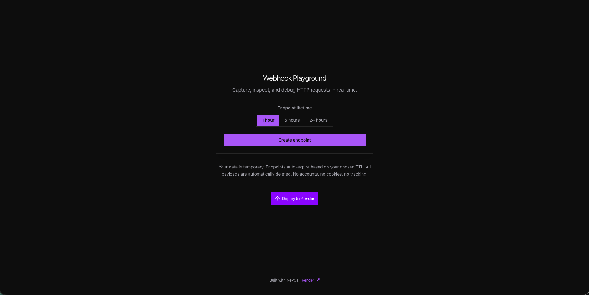
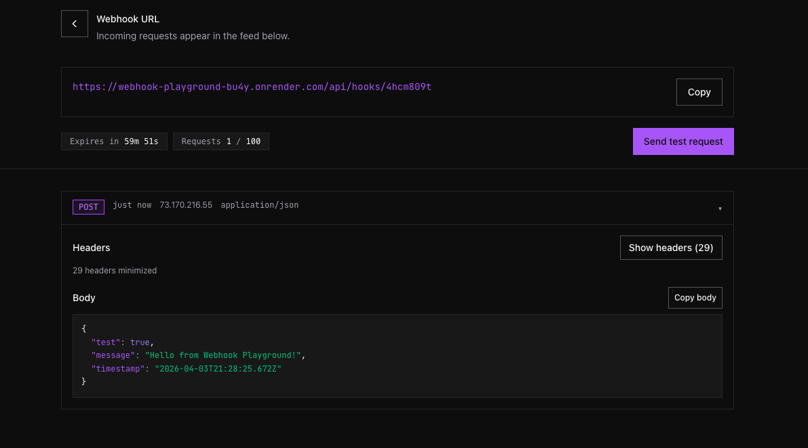

# Webhook Playground

**Disposable webhook URLs for debugging integrations.** Create a temporary URL, send traffic from any client, and watch requests arrive in real time with headers and body, no signup required.

  

| | |
|:---|:---|
| **Stack** | Next.js 14 · TypeScript · PostgreSQL · [Render](https://render.com) |
| **License** | MIT |

---

## What you get

- **Instant endpoints** with a TTL you choose (1, 6, or 24 hours).
- **Live feed** of incoming HTTP requests over SSE as they hit your URL.
- **Inspect everything** that matters: method, headers, body, content type, and timing.
- **No accounts** and no tracking. Data expires and is deleted on schedule.

---

## Screenshots

### Landing

Pick TTL, create your URL, and optionally self-host with the Deploy button.

### Hook dashboard

Copy the hook URL, send a test request, and expand a row for headers and JSON.

---

## Deploy with one click

The [Blueprint](https://render.com/docs/blueprint-spec) in [`render.yaml`](./render.yaml) provisions:

| Piece | Role |
|:------|:-----|
| **Web service** | Runs the Next.js app (`plan: standard` in the sample file). |
| **Render Postgres** | Stores endpoints and request payloads (`DATABASE_URL` injected). |
| **Cron** | Hourly cleanup of expired data (`plan: standard`). |

**Forks:** point the deploy button at your repo by changing the `repo=` query on the button URL, or set `NEXT_PUBLIC_BLUEPRINT_REPO_URL` at build time so the in-app deploy link matches your GitHub remote.

---

## Deploy from the dashboard

1. Push this repo to GitHub, GitLab, or Bitbucket.
2. In the [Render Dashboard](https://dashboard.render.com): **New** → **Blueprint** → select the repo → deploy.

`preDeployCommand` runs [`scripts/migrate.js`](./scripts/migrate.js) when `DATABASE_URL` is present so tables exist before traffic hits the new release.

---

## Environment variables

| Variable | Required | Purpose |
|:---------|:---------|:--------|
| `DATABASE_URL` | Yes (on Render) | Injected from the linked Postgres service. |
| `RENDER_EXTERNAL_URL` | Auto on Render | Public base URL for full webhook links in the UI ([docs](https://render.com/docs/environment-variables)). |
| `NEXT_PUBLIC_APP_URL` | No | Override the public origin if you use a **custom domain** and want that host in copied links. |

---

## Troubleshooting

| Symptom | What to check |
|:--------|:----------------|
| Database errors | TLS is configured for Render Postgres in [`lib/pgSsl.js`](./lib/pgSsl.js). |
| Missing tables | Deploy logs should show `Migrations applied.` from **preDeploy**. |
| Wrong URL in the UI | Use the live service URL, or set `NEXT_PUBLIC_APP_URL` for a custom domain. |

---

## Tech stack

| Layer | Choice |
|:------|:-------|
| Framework | Next.js 14 (App Router), TypeScript |
| UI | Tailwind CSS v4, [Render DDS](https://github.com/R4ph-t/DDS) components |
| Data | PostgreSQL via `pg`, raw SQL |
| Realtime | Server-Sent Events (SSE) for the request feed |
| IDs | `nanoid` for endpoint identifiers |

---

## Data handling

- Each endpoint accepts up to **100** stored requests; TTL options are **1 / 6 / 24** hours.
- Expired rows are removed by the cron job.
- **No accounts, no cookies, no tracking.** Protection is URL secrecy only.

---

## License

MIT
